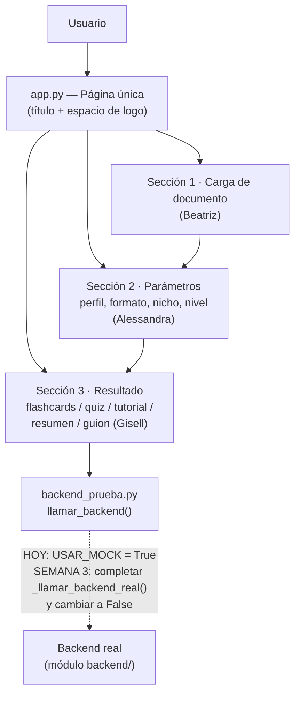

# Interfaz — Frontend de NuevaMente

Interfaz interactiva (Streamlit), en una sola página, para cargar
documentos técnicos, elegir cómo adaptarlos y visualizar el contenido
educativo generado.

## Arquitectura



**Compartidos entre las 3 (avisar antes de tocar):**
`theme.py` (paleta de colores + tipografía), `constants.py` (opciones de
los selects), `backend_prueba.py` (conexión con el backend).

**Flujo de datos (contrato con Backend):**

- **Entrada** (`SolicitudAdaptacion`): `documento_titulo`, `documento_contenido`,
  `perfil_destinatario`, `formato_salida`, `nicho_sector`, `nivel_detalle`.
- **Salida** (`RespuestaAdaptacion`): `status`, `metadatos`, `contenido_adaptado`
  (con `items` cuya forma depende de `formato_salida`), `evaluacion_calidad`,
  `almacenamiento_oci`.

El contrato completo, validado con Pydantic, está en `contrato_schemas.py`,
compartido con el equipo de Backend. **No cambiar los nombres de campos sin
avisar** — rompe tanto esta interfaz como el backend real cuando exista.

## Identidad visual

| | Color | Uso |
|---|---|---|
| Texto | `#F0F0F0` | Texto general |
| Fondo | `#070B22` | Fondo de la app y de las secciones |
| Primario | `#0094F0` | Botones, pastillas de paso |
| Secundario | `#10B77F` | Estados de éxito ("Listo para configurar ✓", puntaje ≥60%) |
| Accent | `#F59F0A` | Pastillas de paso, badges de conceptos clave |

- **Tipografía general:** Nunito
- **Tipografía monoespaciada** (datos técnicos: bucket de OCI, objeto_id): IBM Plex Mono
- **Logo:** aún no existe el archivo — hay un espacio reservado (recuadro
  punteado) en `app.py`, con un comentario `TODO` indicando la única línea
  a cambiar cuando lo tengan.
- **Íconos:** se usarán los Material Symbols nativos de Streamlit
  (`:material/nombre:`), sin librerías externas.

## Estructura de archivos

```
interfaz/
├── README.md                    # este archivo
├── .gitignore                   # archivos sensibles de este módulo
├── requirements.txt             # dependencias de interfaz
├── .streamlit/
│   └── config.toml              # tema nativo de Streamlit (colores base)
├── app.py                       # Página única: une las 3 secciones
├── theme.py                     # Paleta de colores + tipografía + donut de puntaje
├── backend_prueba.py            # Punto único de conexión con el backend (mock / real)
├── constants.py                 # Opciones de los selects
└── pages/
    ├── __init__.py
    ├── seccion1_carga.py         # Beatriz
    ├── seccion2_parametros.py    # Alessandra
    └── seccion3_resultados.py    # Gisell (5 formatos completos)
```

## Guía de instalación local

**Requisitos:** Python 3.10+

```bash
# 1. Entrar a la carpeta
cd interfaz

# 2. (Opcional) Crear un entorno virtual
python3 -m venv venv
source venv/bin/activate      # En Windows: venv\Scripts\activate

# 3. Instalar dependencias
pip install -r requirements.txt

# 4. Correr la app
streamlit run app.py
```

La app se abre automáticamente en `http://localhost:8501`.

## Ejemplo de uso mínimo

1. En la Sección 1, sube un PDF/Markdown/TXT o pega texto técnico, y ponle un título.
2. En la Sección 2, elige perfil, formato, nicho y nivel de detalle, y
   dale clic a "Generar contenido de estudio".
3. El resultado aparece automáticamente debajo, en la Sección 3, con el
   formato correspondiente:
   - **Flashcards:** navegación tarjeta por tarjeta, con "toca para revelar".
   - **Quiz:** opciones con letra (A/B/C/D), verificación por pregunta y
     círculo de puntaje final al responder todas.
   - **Tutorial / Resumen / Guion:** contenido adaptado en texto.

## Estado actual — cumplimiento con el brief y el checklist del hackathon

| Requisito | Estado |
|---|---|
| Interfaz interactiva (Streamlit) | ✅ |
| Carga de PDF, Markdown o texto | ✅ |
| Parametrización (perfil, formato, nicho, nivel de detalle) | ✅ |
| Salida en JSON estructurado (contrato Pydantic) | ✅ |
| Validación de esquemas + manejo de errores amigables | ✅ |
| Soporte para los 4 perfiles y 5 formatos del brief | ✅ |
| Documentación con arquitectura + guía de instalación | ✅ (este archivo) |
| Ramas por módulo/tarea, PR con aprobación | ✅ |
| Ingestión real del documento (extracción de texto) | ⏳ depende de `ingesta-rag` |
| Conexión real con RAG + LLM | ⏳ depende de `orquestacion-agentes` / `backend` (Semana 3) |
| Integración con OCI Object Storage | ⏳ depende de `backend` / `oci-storage` |
| Mínimo 3 escenarios de ejecución documentados | ⏳ se hace en Semana 4, con todo integrado |
| Logo e íconos | ⏳ espacio reservado, pendiente de archivo/decisión final |

## Convención de ramas de este módulo

Sigue el mismo patrón de las Pautas de Desarrollo y Contribución del repo:

```
interfaz                          → rama de módulo (creada desde main)
├── interfaz-seccion1-carga        → rama de tarea (se borra tras merge)
├── interfaz-seccion2-parametros   → rama de tarea (se borra tras merge)
└── interfaz-seccion3-resultados   → rama de tarea (se borra tras merge)
```

Cada rama de tarea abre su PR hacia `interfaz` (no hacia `main`), con al
menos 1 aprobación antes de mergear. Cuando las 3 secciones estén
fusionadas en `interfaz`, se abre un PR final: `interfaz → main`.

## Checklist antes de abrir un PR

- [ ] El código corre local sin errores
- [ ] No se subieron archivos sensibles (`.env`, credenciales, claves de OCI)
- [ ] `requirements.txt` actualizado si se agregó una dependencia
- [ ] Se usó el formato de conventional commits (`feat:`, `fix:`, `docs:`)