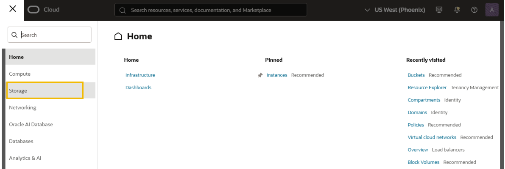
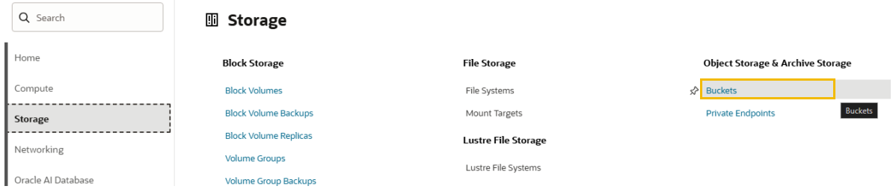
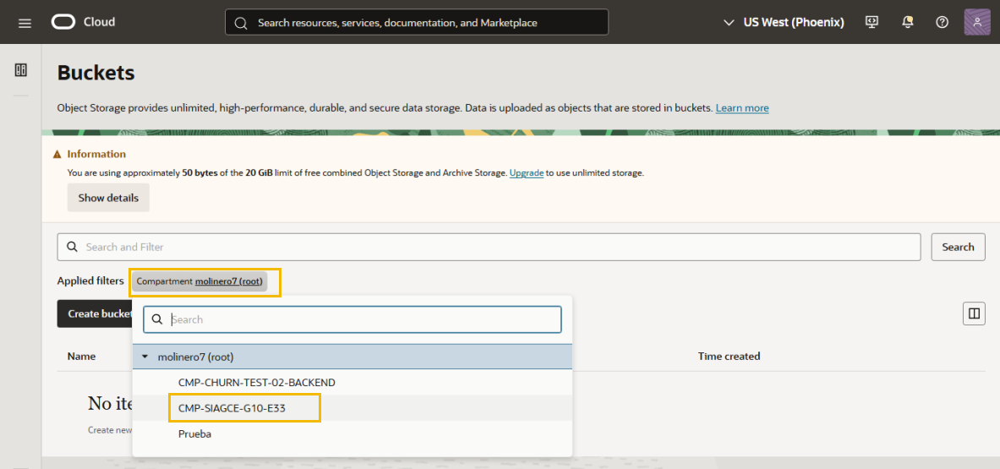
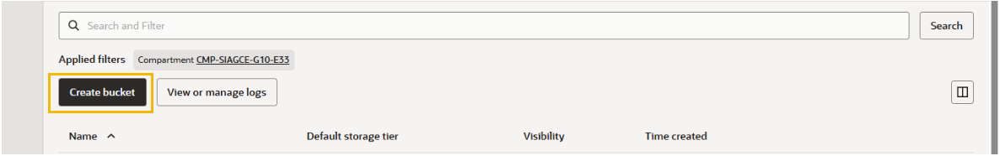
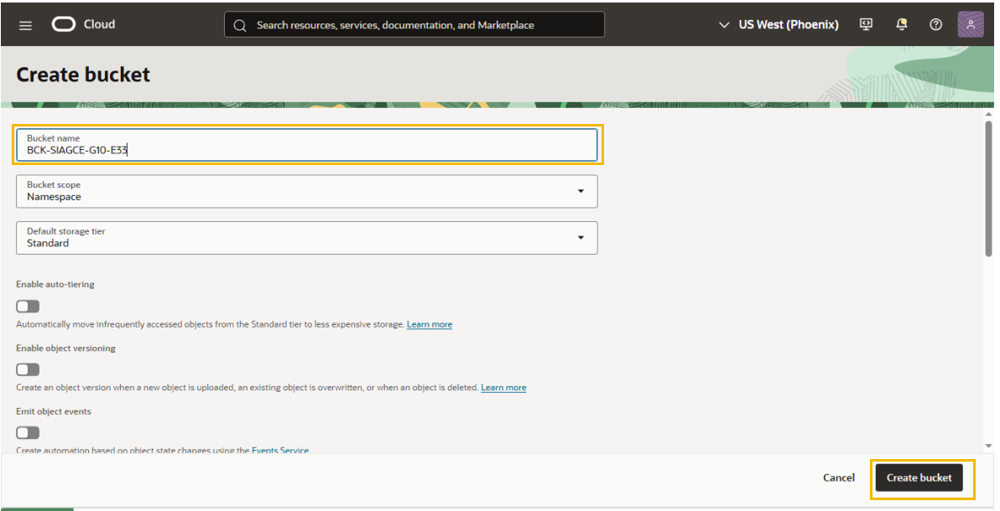
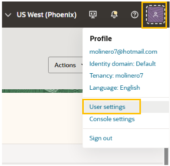
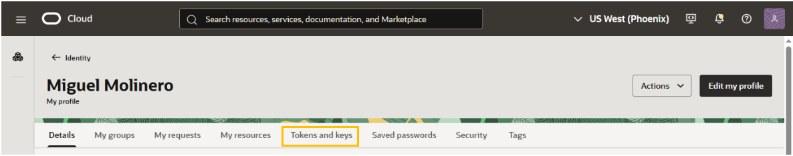
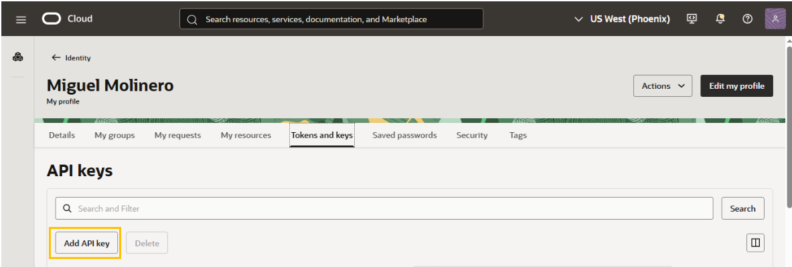
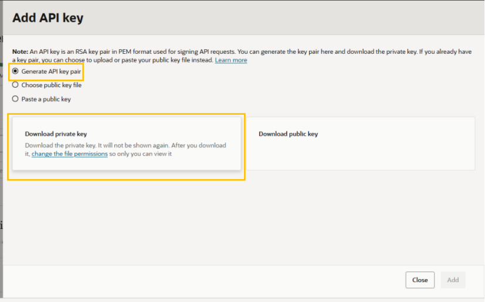
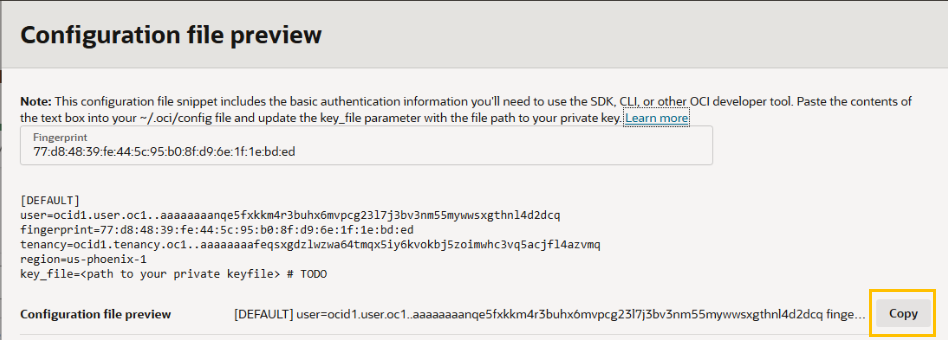

# Bucket

[toc]

## Creación del Bucket en OCI

En el portal de OCI seleccionar la opción **Storage** del panel izquierdo



Seleccionar la opción **Buckets**



Al lado de **Applied filters**, seleccionar el compartimento donde se alojará el Bucket



Dar click en el botón **Create bucket**



Escribir el nombre del bucket y dar click en el botón **Create bucket**




## Instrucciones para conectividad de un bucket con Python y la librería OCI.

Actualiza pip dentro de tu entorno virtual para evitar problemas de compatibilidad al instalar las librerías:

```
python -m pip install --upgrade pip
```

Ahora instala el SDK oficial de Oracle Cloud Infrastructure (oci) y la librería python-dotenv (para leer variables de entorno desde un archivo .env):

```
pip install oci python-dotenv
```

Verificación de la instalación de oci:

```
pip show oci
```

Ahora crea el archivo **.env** en la raíz de la carpeta **buckettesting**. Puedes crearlo desde la interfaz de IntelliJ (*clic derecho en la carpeta buckettesting -> New -> File -> .env*) o desde la terminal ejecutando:

```
type nul > .env
```

Para conectar con Oracle Cloud Infrastructure (OCI) mediante el SDK, necesitas generar **un par de claves API (API Key)** desde la consola de Oracle y descargar la clave privada en tu PC.

Para facilitarte esto, primero crea una carpeta dentro de buckettesting para guardar de forma segura tus llaves y tu archivo de configuración de OCI. Ejecuta en la terminal:

```
mkdir .oci
```

Ahora dirígete a la consola web de Oracle Cloud Infrastructure (OCI) e inicia sesión con tu cuenta.

Una vez dentro:

- Haz clic en el ícono de tu perfil (esquina superior derecha).

- Selecciona **User settings** (o Configuración de usuario).





En el menú, haz clic en **Tokens and keys**.



Haz clic en el botón **Add API Key**.




Deja seleccionada la opción **Generate API Key Pair**.

Haz clic en el botón **Download Private Key** y guarda el archivo descargado (tendrá un nombre terminado en .pem).




Mueve o copia ese archivo descargado a la carpeta .oci que creamos hace un momento dentro de buckettesting, y renómbralo a oci_api_key.pem

Haz clic en el botón **Add** en la ventana de OCI


Al hacer clic en **Add**, la consola de OCI te muestra una ventana flotante con un cuadro de texto titulado Configuration File Preview.

Copia todo el contenido de ese cuadro de texto.




Luego, dentro de tu proyecto buckettesting, crea un archivo llamado **config** dentro de la carpeta *.oci* (es decir, en *buckettesting\.oci\config*) y pega ahí el texto copiado.

Asegúrate de que la línea **key_file** dentro de ese archivo apunte a la ruta donde guardaste tu llave privada. Debería verse similar a esto:

```
key_file=./.oci/oci_api_key.pem
```

Ahora abre el archivo **.env** que creaste anteriormente en la raíz del proyecto y agrega las variables correspondientes a tus datos de OCI y tu Bucket.

Pega el siguiente contenido adaptándolo con tus valores reales:

```
OCI_CONFIG_FILE=./.oci/config
OCI_PROFILE=DEFAULT
OCI_TENANCY_OCID=ocid1.tenancy.oc1..tu_tenancy_ocid
OCI_NAMESPACE=tu_namespace
OCI_BUCKET_NAME=tu_nombre_de_bucket
```

Nota:

>Tu **OCI_TENANCY_OCID** lo encuentras dentro del archivo **.oci/config** que acabas de guardar.
>
>Tu **OCI_NAMESPACE** lo puedes ver en la consola de OCI buscando la información de tu bucket o en la configuración de la cuenta (Object Storage Namespace).


Ahora crea el archivo principal de Python en la raíz del proyecto buckettesting.

Puedes crearlo desde IntelliJ o con la terminal ejecutando:

```
type nul > main.py
```

Abre el archivo **main.py** y agregamos:
1. Al inicio las librerías necesarias para cargar las variables de entorno, autenticarte en OCI e interactuar con el servicio de Object Storage.
2. Leer las variables de entorno del archivo .env e inicializar el cliente de Object Storage usando la clave que configuraste.
3. Agregar la función para subir (cargar) un archivo al bucket de OCI.
4. Agregar la función para leer (descargar) un archivo desde el bucket de OCI y guardarlo en tu PC.
5. Añadir el bloque de ejecución principal al final de main.py para probar la subida de un archivo de texto de ejemplo y su posterior descarga.

*Código Python*
```
import os
import oci
from dotenv import load_dotenv

# Cargar las variables definidas en el archivo .env
load_dotenv()

# Obtener configuraciones del .env
config_file = os.getenv("OCI_CONFIG_FILE")
profile = os.getenv("OCI_PROFILE", "DEFAULT")
namespace = os.getenv("OCI_NAMESPACE")
bucket_name = os.getenv("OCI_BUCKET_NAME")

# Cargar la configuración de autenticación de OCI
config = oci.config.from_file(config_file, profile)

# Inicializar el cliente para Object Storage
object_storage_client = oci.object_storage.ObjectStorageClient(config)

# ***********************************************

def upload_file(local_file_path, object_name=None):
    if object_name is None:
        object_name = os.path.basename(local_file_path)
        
    with open(local_file_path, "rb") as file_data:
        response = object_storage_client.put_object(
            namespace_name=namespace,
            bucket_name=bucket_name,
            object_name=object_name,
            put_object_body=file_data
        )
    print(f"Archivo '{object_name}' subido exitosamente al bucket.")
return response

# ***********************************************

def download_file(object_name, destination_path):
    response = object_storage_client.get_object(
        namespace_name=namespace,
        bucket_name=bucket_name,
        object_name=object_name
    )
    
    with open(destination_path, "wb") as file_out:
        for chunk in response.data.raw.stream(1024 * 1024, decode_content=False):
            file_out.write(chunk)
            
    print(f"Archivo '{object_name}' descargado correctamente en '{destination_path}'.")

# ***********************************************

if __name__ == "__main__":
    # 1. Crear un archivo de texto local de prueba
    test_filename = "prueba.txt"
    with open(test_filename, "w", encoding="utf-8") as f:
        f.write("Hola OCI, prueba de subida y lectura desde Python!")

    # 2. Subir el archivo al bucket
    print("--- Subiendo archivo ---")
    upload_file(test_filename, "prueba_oci.txt")

    # 3. Leer/Descargar el archivo desde el bucket
    print("\n--- Descargando archivo ---")
    download_file("prueba_oci.txt", "descargado_prueba.txt")
    
```


